# 🚀 Reporthole – GitHub Workflow Guide

This guide walks you through how to clone the Reporthole repositories, create a feature branch from `develop`, make changes, commit, and push. Follow these steps every time you start working on a new feature.

---

## 📋 Prerequisites

- Download and install [GitHub Desktop](https://desktop.github.com/)
- Sign in with your GitHub account by clicking **Sign in to GitHub.com**
- Make sure you have been added to the **UrbanEye-UJ** organisation on GitHub

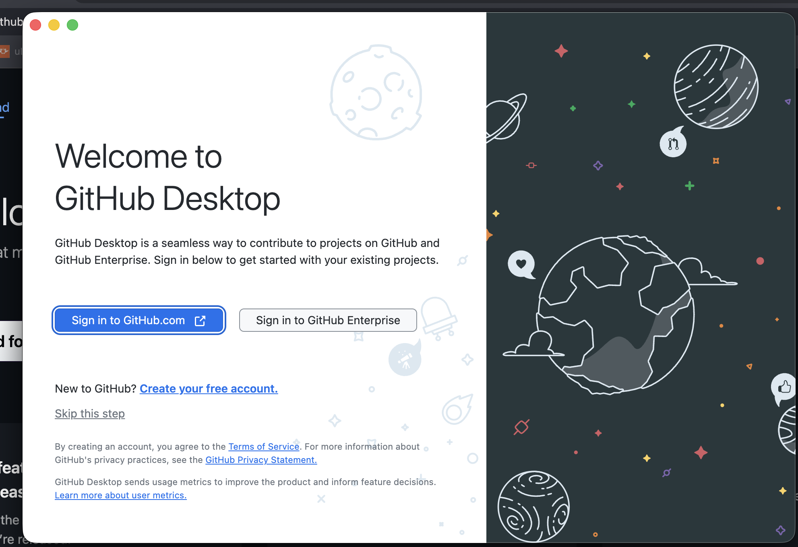

---

## 🔁 Part 1 – Clone the Backend Repository (`reporthole-be`)

### Step 1: Open GitHub Desktop and clone the repo

1. Open GitHub Desktop — you will see your repositories listed on the left
2. Click **"Clone a Repository from the Internet..."** on the right panel

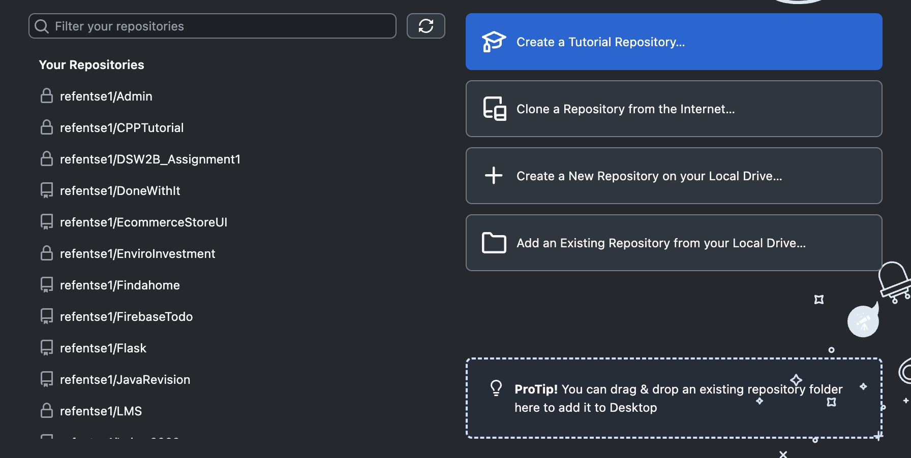

3. In the search box, type `urban` — you will see the **UrbanEye-UJ** organisation appear
4. Select **`UrbanEye-UJ/reporthole-be`**
5. Choose a Local Path (e.g. `/Users/yourname/Documents/GitHub/reporthole-be`)
6. Click **Clone**

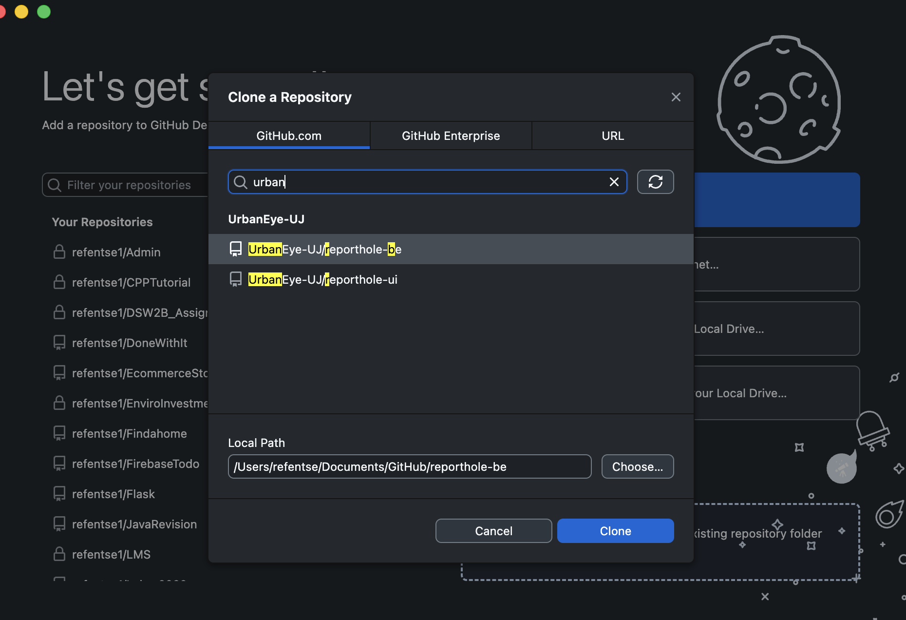

> 💡 You will see two repos under UrbanEye-UJ: `reporthole-be` (backend) and `reporthole-ui` (frontend). Start with `reporthole-be`.

---

### Step 2: Switch to the `develop` branch

After cloning, the repo will be on the `main` branch by default. **Never work directly on `main`.**

1. Click the **Current Branch** dropdown at the top
2. Under **Other Branches**, click **`origin/develop`**

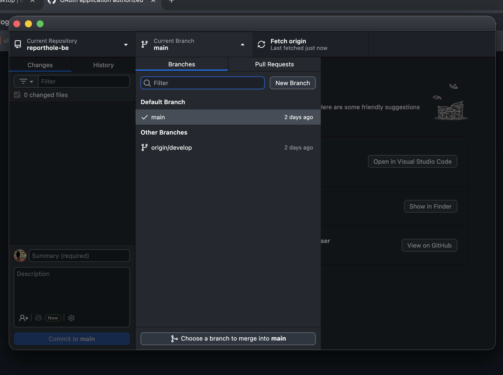

You are now on the `develop` branch.

---

### Step 3: Create your feature branch from `develop`

> ⚠️ Always create your feature branch **from `develop`**, not from `main`.

1. Click the **Current Branch** dropdown again
2. Click **New Branch**
3. The "Create a Branch" dialog will appear — under **"Create branch based on..."**, make sure **`develop`** is selected ✅

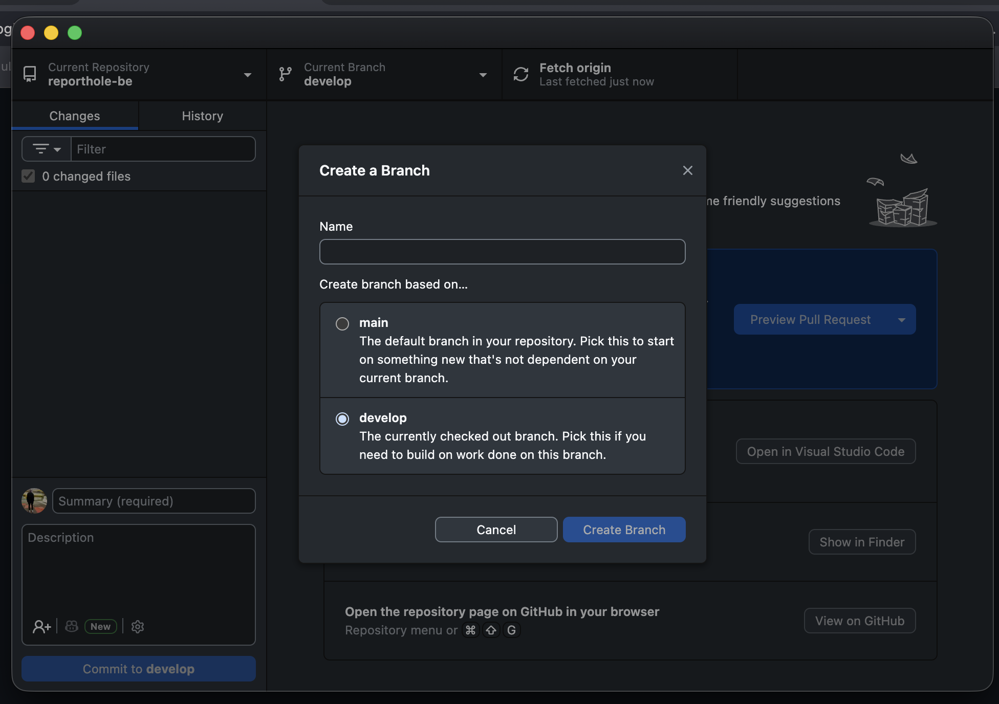

4. Enter a branch name using the format:
   ```
   feature/your-feature-name
   ```
   For example: `feature/civilian-home-screen`

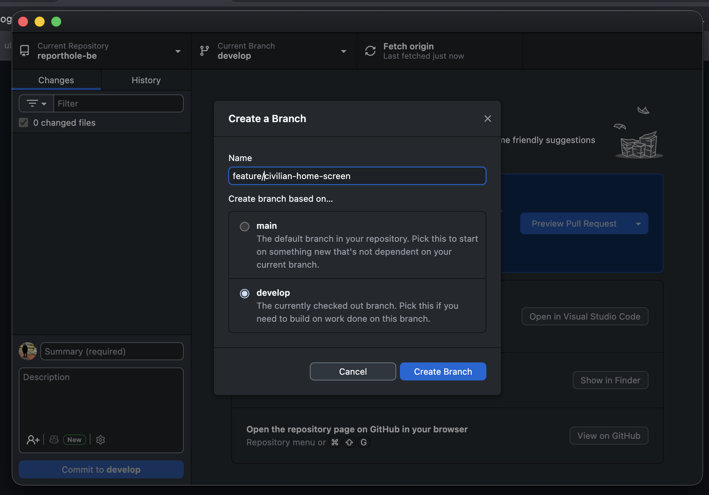

5. Click **Create Branch**

Your new branch is now based on `develop` and ready for your work.

---

### Step 4: Open the project and make your changes

1. Click **Open in Visual Studio Code** (or your preferred editor)
2. Make your code changes inside the project

---

### Step 5: Commit your changes

Once you have made changes, go back to GitHub Desktop. You will see your changed files listed under the **Changes** tab with a diff preview on the right.

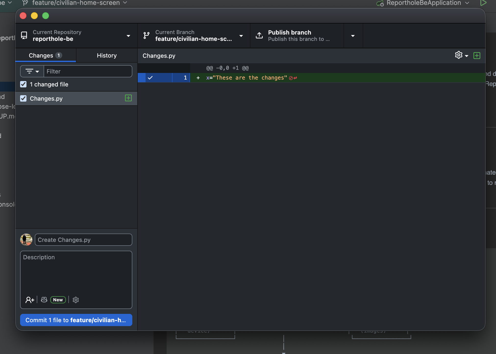

1. In the **Summary** field (bottom left), write a short, clear commit message, e.g.:
   ```
   Add civilian home screen layout
   ```
2. Optionally add a description for more detail
3. Click **Commit to feature/your-feature-name**

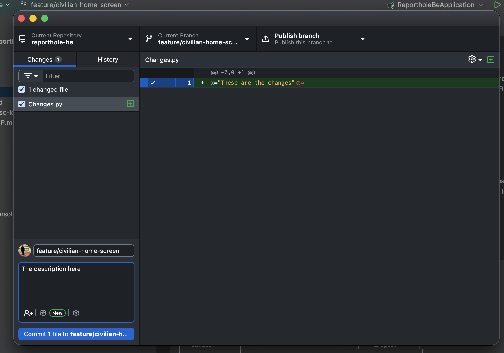

---

### Step 6: Publish and push your branch

After committing, you will see a **"Publish your branch"** prompt — this means your branch only exists locally and hasn't been pushed to GitHub yet.

1. Click **Publish branch** to push your branch to GitHub for the first time
2. On subsequent commits, this button will say **Push origin** — click it to sync

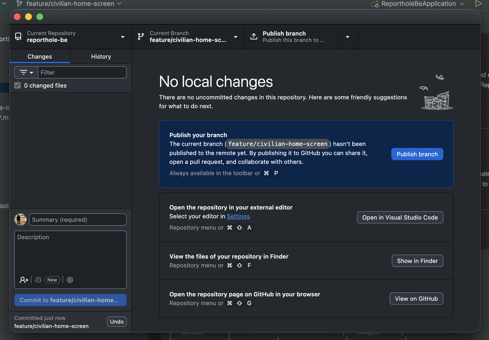

Your branch and commits are now visible on GitHub for the team to see and review.

---

## 🔁 Part 2 – Clone the Frontend Repository (`reporthole-ui`)

Once the backend is set up, repeat the same process for the frontend.

### Step 1: Clone `reporthole-ui`

1. In GitHub Desktop, click the **Current Repository** dropdown (top left)
2. Click **Add** → **Clone Repository...**

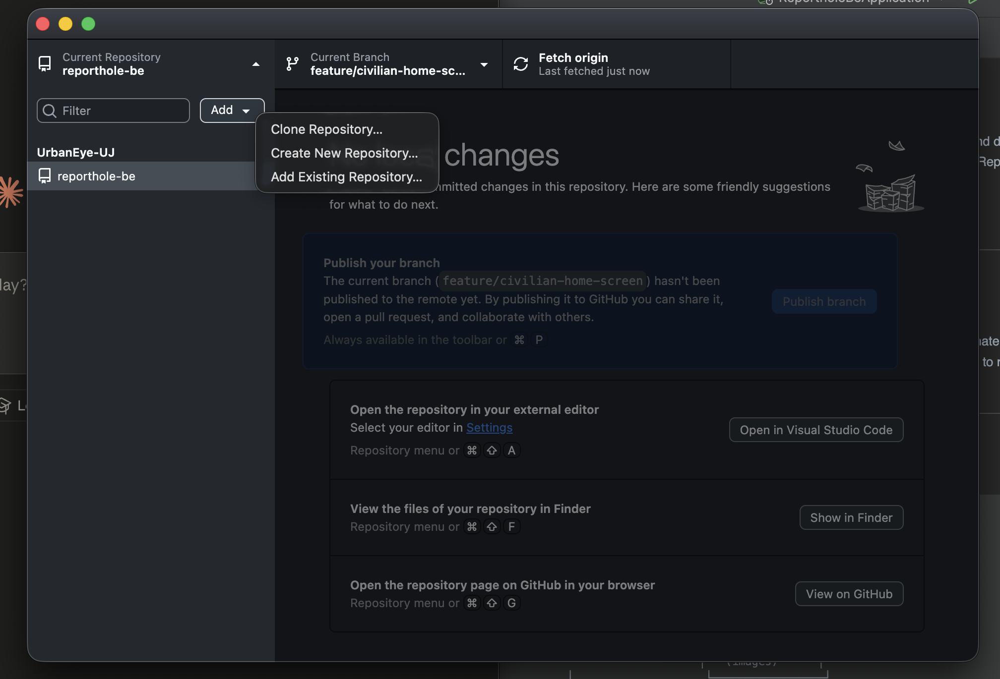

3. Search `urban` again and select **`UrbanEye-UJ/reporthole-ui`**
4. Set your Local Path (e.g. `/Users/yourname/Documents/GitHub/reporthole-ui`)
5. Click **Clone**

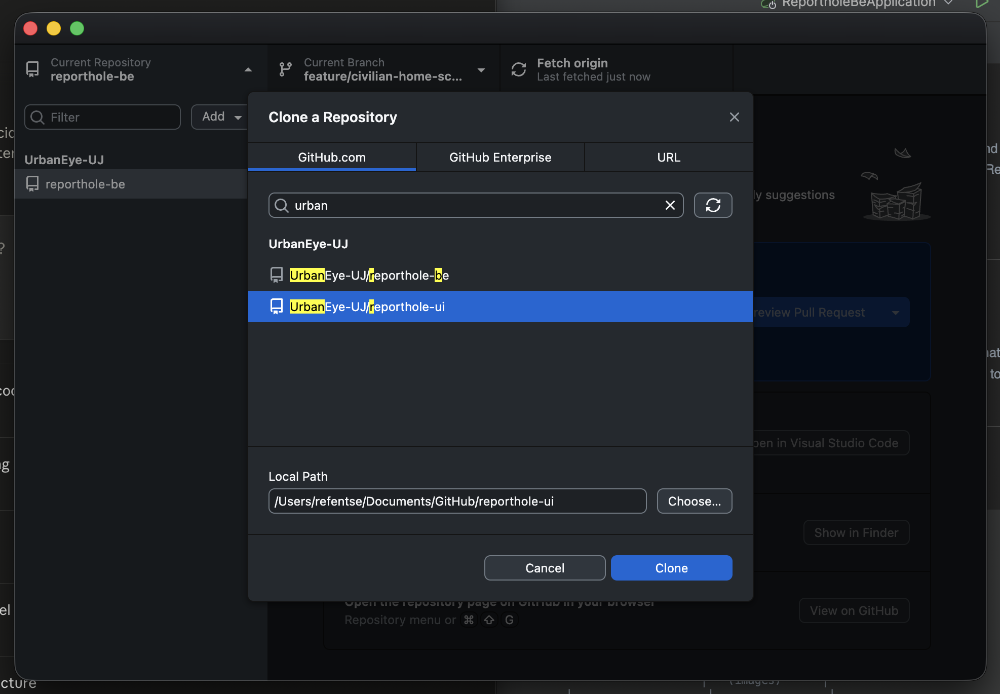

---

### Step 2: Switch to `develop` and create your feature branch

Repeat the exact same steps from Part 1:

1. Switch to **`origin/develop`** from the Current Branch dropdown
2. Create a new branch using the `feature/your-feature-name` naming convention
3. Select **`develop`** as the base branch ✅
4. Click **Create Branch**

---

### Step 3: Make changes, commit, and push

Same as Part 1 Steps 4–6. Make your changes, write a clear commit message, and publish/push your branch.

---

## 📐 Branch Naming Convention

Always use lowercase with hyphens. Follow this format:

| Type | Format | Example |
|------|--------|---------|
| New feature | `feature/description` | `feature/civilian-home-screen` |
| Bug fix | `fix/description` | `fix/login-crash` |
| Hotfix | `hotfix/description` | `hotfix/null-gps-coordinates` |

---

## 🔄 Summary: The Full Workflow

```
main
 └── develop                    ← always branch FROM here
       └── feature/your-work    ← work happens here
             └── commit & push  ← then open a Pull Request → develop
```

1. Clone the repo
2. Switch to `develop`
3. Create a `feature/` branch **from `develop`**
4. Write code → commit with a clear message
5. Publish/push your branch
6. Open a Pull Request on GitHub targeting `develop`

---

## ❗ Important Rules

- **Never commit directly to `main` or `develop`**
- Always create your branch **from `develop`**
- Keep commit messages short and descriptive
- Push regularly so the team can see your progress
- When your feature is done, open a **Pull Request** on GitHub from your branch → `develop`

---

*UrbanEye-UJ · Reporthole · Capstone Project*